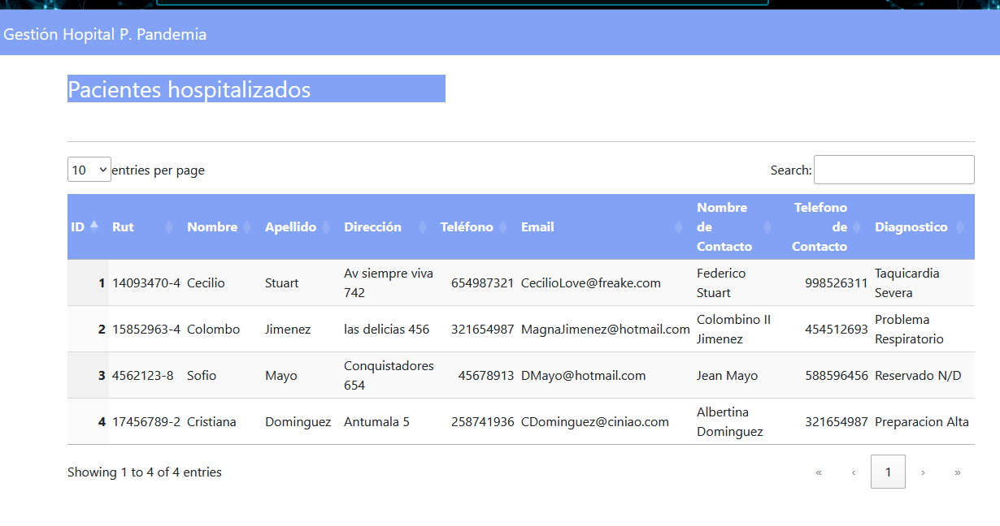

Desafío - El framework Spring (I)
--
En este desafío validaremos nuestros conocimientos de creación de proyectos web Spring Boot. Para lograrlo, necesitarás aplicar todo lo aprendido en esta unidad.

Lee todo el documento antes de comenzar el desarrollo individual de este desafío, para
asegurarte de tener el máximo de puntaje y enfocar bien los esfuerzos. Una vez terminado el
desafío, comprime la carpeta que contiene el desarrollo de los requerimientos solicitados y
sube el .zip en el LMS.

Descripción
-
<b>Proyecto Hospital post pandemia.</b>

Tras el paso del coronavirus a nivel nacional, se levantó la necesidad de tener un registro en
el sistema de todos los pacientes hospitalizados. Por ello, la empresa de software está
solicitando nuevamente sus servicios para actualizar el software ya creado anteriormente,
con el objetivo de implementarlo en los hospitales de todo el país.

De acuerdo a este contexto, deberás de mostrar un aplicativo web Spring Boot donde en el
sistema muestre el listado de los pacientes que se encuentran hospitalizados. El plus más
importante de este aplicativo es saber mostrar los conocimientos previos sobre el uso de
las anotaciones, y la inyección de dependencias bajo la arquitectura de Spring.

Para este desafío necesitamos que retorne en pantalla una lista estática de pacientes
levantando tu aplicación web Spring boot.

Requerimientos
--

Mediante la utilización del IDE de desarrollo Eclipse, se debe crear un nuevo proyecto Web
Spring Boot llamado “ProyectoHospitalPost”.

1. Crear un nuevo proyecto Web Spring Boot llamado “ProyectoHospitalPost
Pandemia” que contenga la estructura de un proyecto Spring, las anotaciones
correspondientes, el uso del logger al momento de listar pacientes, y la inyecciones
de dependencias (2.5 Puntos)

2. Implementar las buenas prácticas del uso de controllers. (2.5 Puntos)

3. Retornar en pantalla la lista de los pacientes. (2.5 Puntos)

4. Implementar vista con Thymeleaf y/o JSP. (2.5 Puntos)

¡Mucho éxito!

Consideraciones y recomendaciones

1. Se puede apoyar de los ejercicios vistos en unidades anteriores a modo de
consulta.
2. Debes recordar el uso de anotaciones, logger, y la inyección de dependencias.

Imagenes del Proyecto Realizado:

